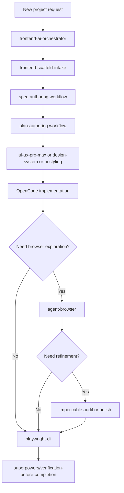
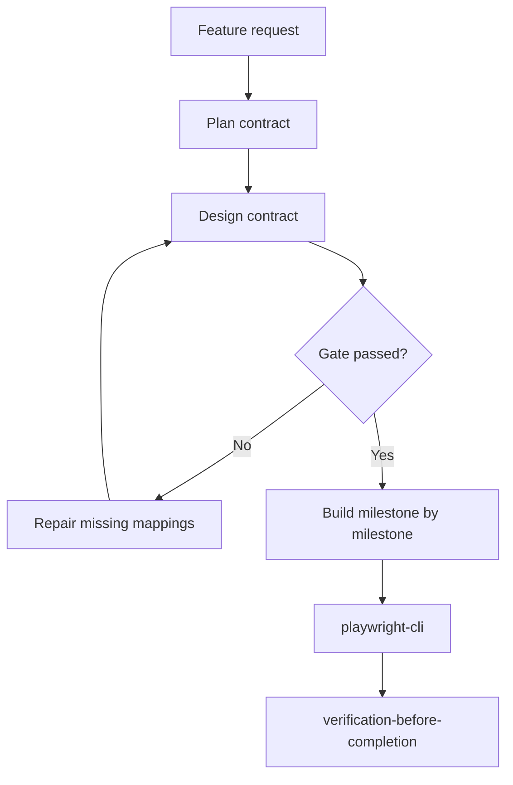
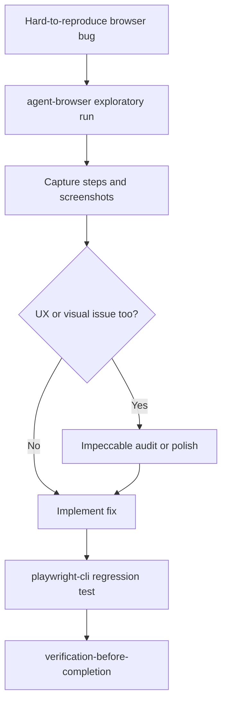
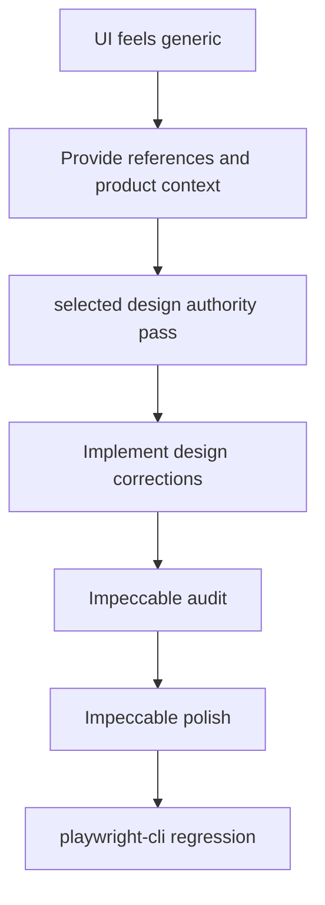
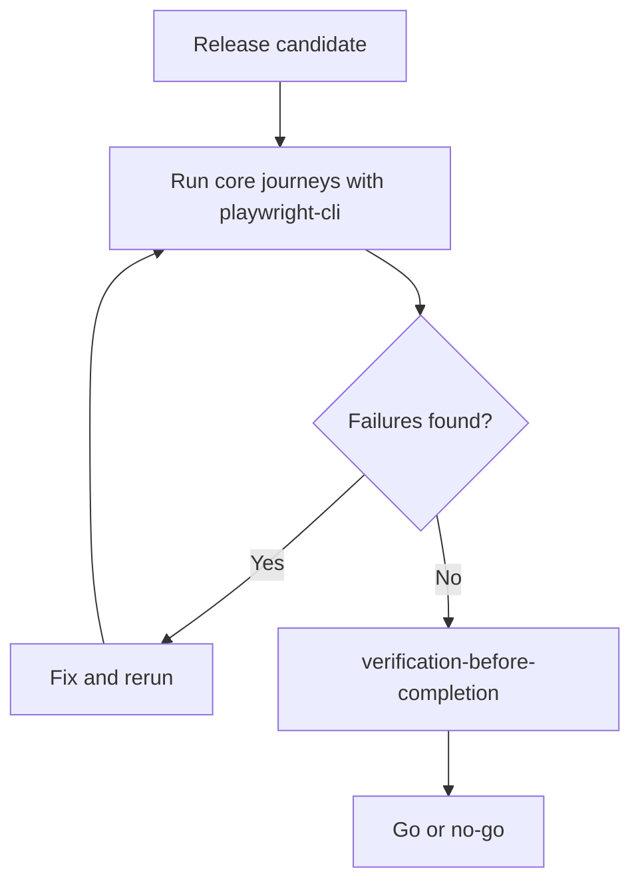

# Scenarios And Flows

This page translates the workflow into practical team scenarios. Each scenario shows the recommended entry point and which skills are doing the work.

## Scenario 1: Start A New Frontend Project

Best entry point: `frontend-ai-orchestrator`

Why:

- it automatically routes to the scaffold skill first
- it reduces the need to manually mention each downstream skill
- it gives the team a consistent phase order

## Scenario 2: Build A New Feature In An Existing App

Best entry point: `frontend-ai-orchestrator` or manual phase entry

Recommended skill path:

- `superpowers/brainstorming` or the closest planning/spec workflow exposed in your environment
- `superpowers/writing-plans` or the closest plan-authoring workflow exposed in your environment
- `ui-ux-pro-max`, `design-system`, or `ui-styling`
- `superpowers/executing-plans`
- `playwright-cli`
- `superpowers/verification-before-completion` or equivalent evidence-first verification

## Scenario 3: A Bug Only Happens In The Real Browser

Best entry point: `agent-browser`

Use this when:

- you want screenshots quickly
- the problem depends on real browser behavior
- you want a human-readable reproduction before writing stable tests

## Scenario 4: The UI Works But Still Feels AI-Generated

Best entry point: `ui-ux-pro-max`, `design-system`, or `ui-styling` plus Impeccable

This is the best path when:

- the layout is functional but visually average
- the AI keeps drifting into generic patterns
- you want stronger typography, color, spacing, and hierarchy

## Scenario 5: Pre-Release Validation

Best entry point: `playwright-cli`

This is the minimum web-release path even when optional skills are skipped.

## Skill Routing Summary

| Scenario | Start with | Optional follow-up | Required finish |
|---|---|---|---|
| New app | `frontend-ai-orchestrator` | `agent-browser`, Impeccable | `playwright-cli`, `verification-before-completion` |
| New feature | Orchestrator or plan/design manually | `agent-browser`, Impeccable | `playwright-cli`, `verification-before-completion` |
| Real browser bug | `agent-browser` | Impeccable if UX is involved | `playwright-cli`, `verification-before-completion` |
| Visual polish | `ui-ux-pro-max`, `design-system`, or `ui-styling` | Impeccable | `playwright-cli` |
| Release gate | `playwright-cli` | none or targeted polish | `verification-before-completion` |

## Practical Tips From Real Usage

These are important presentation points because they explain how the workflow feels in practice:

1. The orchestrator is the fastest way to start a new project because it routes the work without you manually naming every skill.
2. The number of clarification questions depends heavily on the first prompt. If the prompt already includes stack, style, constraints, and references, the flow is usually much faster.
3. Bundling closely related work into a small number of well-scoped tasks can reduce repeated implementation-review-fix loops from subagent-heavy workflows. This is a preference tradeoff, not a universal rule.
4. `agent-browser` is especially useful when you want screenshots, live browser evidence, or exploratory QA before turning findings into stable tests.
5. Impeccable `audit` and `polish` are strong finishing tools when the UI is technically correct but still needs design quality control.
6. Reference-rich prompts help a lot. Website examples, screenshots, brand examples, and image references reduce generic AI output.
7. If you use a separate `dogfood`-style evaluation skill in your environment, it fits naturally after implementation or before a final polish pass. It is not bundled in this repository, so treat it as an optional extension.

## Related Docs

- [04-using-orchestrator.md](./04-using-orchestrator.md)
- [05-using-individual-skills.md](./05-using-individual-skills.md)
