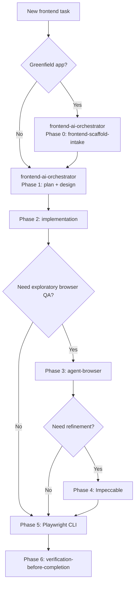

# Frontend AI Workflow Docs

This documentation package explains how this repository uses OpenCode, Docker, and a curated skill stack to deliver frontend work in a repeatable way.

Use this doc set when you want to:

- onboard teammates quickly
- explain when to use the orchestrator versus individual skills
- show real usage scenarios and skill flow
- justify why this setup is containerized instead of installed directly on each machine

## Document Map

| Document | Purpose |
|---|---|
| [01-setup.md](./01-setup.md) | First-time setup, build, first run, and verification |
| [02-docker-usage.md](./02-docker-usage.md) | Daily Docker commands and runtime patterns |
| [03-scenarios-and-flows.md](./03-scenarios-and-flows.md) | Common scenarios, use cases, and Mermaid flow graphs |
| [04-using-orchestrator.md](./04-using-orchestrator.md) | How to use `frontend-ai-orchestrator` effectively |
| [05-using-individual-skills.md](./05-using-individual-skills.md) | Individual skill reference and recommendations for FE work |
| [06-custom-skills-and-rationale.md](./06-custom-skills-and-rationale.md) | Why the custom skills exist and why this stack runs in Docker |
| [07-omo-variant.md](./07-omo-variant.md) | Optional `oh-my-openagent` variant, tradeoffs, and setup |

## Stack At A Glance

- OpenCode is the main coding harness.
- Docker gives the team a reproducible environment.
- `frontend-ai-orchestrator` is the preferred entry point for end-to-end frontend work.
- `frontend-scaffold-intake` handles greenfield setup safely.
- Superpowers provides planning, implementation discipline, debugging, and release verification.
- UI UX Pro Max provides design-system intelligence and visual direction.
- Playwright CLI is the deterministic browser and regression layer.
- agent-browser is the exploratory browser layer.
- Impeccable is the refinement and anti-AI-slop layer.

## Recommended Default Path

## What Is Custom In This Repo

Two skills were created manually for this workflow:

- `frontend-ai-orchestrator`
- `frontend-scaffold-intake`

They exist because the upstream skills are strong specialists, but they do not define the exact team workflow, gating, and safe scaffold rules used in this repository.

Read more:

- [04-using-orchestrator.md](./04-using-orchestrator.md)
- [06-custom-skills-and-rationale.md](./06-custom-skills-and-rationale.md)

## Source Material

This documentation is based on both local repo files and the upstream skill sources:

- [README.md](../README.md)
- [frontend-ai-playbook.md](../frontend-ai-playbook.md)
- [frontend-ai-manual-skill-flow.md](../frontend-ai-manual-skill-flow.md)
- [skills/frontend-ai-orchestrator/SKILL.md](../skills/frontend-ai-orchestrator/SKILL.md)
- [skills/frontend-scaffold-intake/SKILL.md](../skills/frontend-scaffold-intake/SKILL.md)
- <https://github.com/obra/superpowers>
- <https://github.com/nextlevelbuilder/ui-ux-pro-max-skill>
- <https://github.com/pbakaus/impeccable>
- <https://github.com/microsoft/playwright-cli/tree/main/skills/playwright-cli>
- <https://github.com/vercel-labs/agent-browser>
