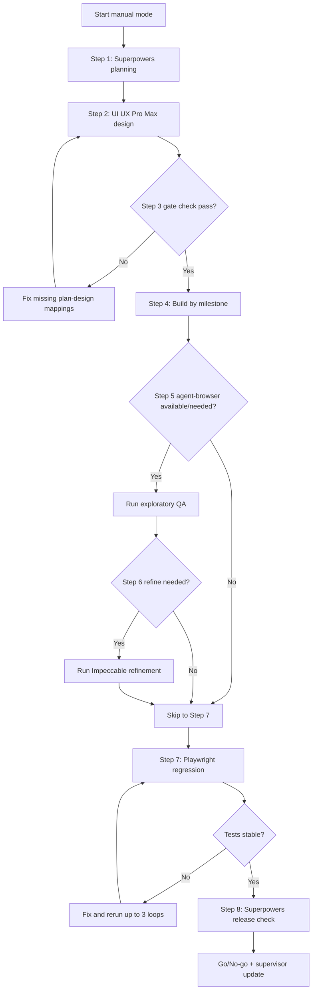

# Frontend Manual Skill Guide (User Path, No Orchestrator)

Use this guide when you want to run each skill manually as a user, step by step.

Goal:
1. Plan clearly
2. Design consistently
3. Build in milestones
4. Test deterministically
5. Ship with confidence

## How To Use This Guide

1. Run the steps in order.
2. Copy one prompt template at a time.
3. Do not move to the next step until you get the expected output.
4. For web apps, keep Playwright as your release-blocking regression test.

## Flow Graph (Mermaid)



## Step 1: Planning With Superpowers

What you do:
1. Ask Superpowers to create scope + implementation plan.
2. Make sure milestones and acceptance criteria are explicit.

Expected output:
1. `SPEC.md`
2. `PLAN.md` with milestone IDs (`M1..Mn`) and acceptance criteria IDs (`AC1..ACn`)

Prompt template:

```text
Use superpowers/brainstorming, then superpowers/writing-plans.
Task: <feature/task>
Constraints: <stack, deadline, requirements>
Output SPEC.md and PLAN.md with explicit M# and AC# IDs.
```

## Step 2: Design With UI UX Pro Max

What you do:
1. Give UI UX Pro Max your product context and stack.
2. Ask it to convert plan milestones into design rules.

Expected output:
1. `DESIGN.md`
2. `design-system/MASTER.md` (or your design-system file)

Prompt template:

```text
Use ui-ux-pro-max to generate DESIGN.md from PLAN.md.
Product/industry: <domain>
Target stack: <framework>
Include color/type/spacing tokens, component rules, anti-patterns, and M# mapping.
```

## Step 3: Manual Gate Check Before Build

Check these 3 things:
1. Every `M#` in `PLAN.md` is mapped in `DESIGN.md`.
2. Every major section in `DESIGN.md` maps back to at least one `M#`.
3. Acceptance criteria are measurable.

If check fails:
1. Ask for targeted fixes only for missing mappings.
2. Retry up to 2 times, then decide whether to proceed with known gaps.

## Step 4: Build By Milestone

What you do:
1. Implement one milestone at a time.
2. Verify each milestone before moving on.

Prompt template:

```text
Implement milestone <Mx> from PLAN.md using DESIGN.md rules.
Use small verifiable steps.
After implementation, summarize what changed and what is verified.
```

## Step 5: Optional Exploratory QA With agent-browser

When to run:
1. You want real browser behavior validation.
2. You need reproduction steps/screenshots for tricky issues.

If unavailable:
1. Skip this step and continue to Playwright regression.

Prompt template:

```text
Use agent-browser to run exploratory QA on <url>.
Scenarios:
1) happy path
2) validation/error states
3) empty/loading states
Return: steps, observed behavior, reproducible issues, and screenshots.
```

## Step 6: Optional UX Refinement With Impeccable

When to run:
1. Step 5 or regression signals UX quality issues.
2. UI feels inconsistent or unclear.

If no meaningful issues:
1. Skip this step.

Prompt template:

```text
Run an impeccable-style refinement pass on:
- <route/component list>
Focus on hierarchy, spacing, contrast, interaction feedback, and copy clarity.
Return prioritized fixes and patch suggestions.
```

## Step 7: Regression Testing With Playwright (Required For Web Release)

What you do:
1. Validate critical user journeys with Playwright.
2. Convert failures into automated tests.
3. Rerun until stable.

Loop rule:
1. Do up to 3 fix-and-rerun loops, then escalate remaining blockers.

Prompt template:

```text
Use playwright-cli to verify critical user journeys:
1) auth/login
2) primary conversion
3) settings/profile
Add/update tests for failures and rerun until stable.
Summarize pass/fail, flaky risks, and remaining gaps.
```

## Step 8: Final Release Check With Superpowers

What you do:
1. Ask for final go/no-go based on requirements, UX, and test signals.
2. Prepare a short update for stakeholders.

Expected output:
1. Coverage summary
2. Quality summary
3. Known limitations
4. Go/No-go recommendation
5. Supervisor update (5 lines max)

Prompt template:

```text
Use superpowers/verification-before-completion.
Summarize:
1) requirement coverage
2) UX quality baseline
3) test outcomes
4) known limitations and risks
5) release recommendation (go/no-go)
Also provide a 5-line supervisor update.
```

## Quick Decision Rules

1. If timeline is tight: skip optional steps 5 and 6, keep steps 1, 2, 4, 7, 8.
2. If visual quality matters most: include steps 5 and 6 before final regression.
3. If tests are unstable: prioritize fixing Playwright reliability before extra polish.
