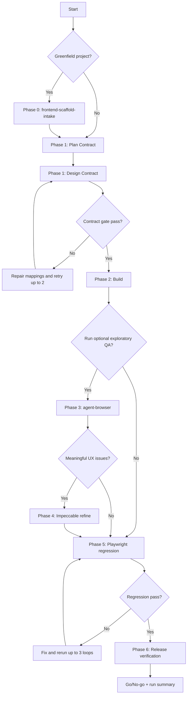

# Frontend AI Playbook (OpenCode + Curated Skills)

This guide shows how to use your full stack together in one frontend workflow.

Reliability policy:
1. Core baseline path must work even if optional skills are unavailable.
2. Optional enhancer phases improve quality but do not block baseline delivery by default.
3. Every phase writes machine-readable status to `.orchestrator/status/phase-<n>.json`.

Skill set:

1. OpenCode as the AI agent
2. Superpowers for SDLC discipline
3. UI UX Pro Max for design generation
4. Playwright CLI for deterministic testing (core)
5. agent-browser for live browser automation and exploratory testing (optional)
6. Impeccable for UI/UX refinement quality (optional)

## Role of Each Tool

| Tool | Primary role | Best moment to use |
|---|---|---|
| OpenCode | Main coding agent and execution driver | Entire lifecycle |
| Superpowers | Planning, execution discipline, debugging, review loops | Before and during implementation |
| UI UX Pro Max | Design systems, design direction, visual system choices | Discovery + design phase |
| Playwright CLI | Repeatable functional/regression checks and release blocker tests | Core regression gate |
| agent-browser | Real browser task execution, exploratory checks, visual/manual flows | Optional QA exploration and bug reproduction |
| Impeccable | Polishing, usability, consistency, anti-pattern detection | Optional refinement when UX issues are found |

## End-to-End Workflow

1. Intake + scaffold the starter app (for greenfield projects)
2. Run a plan contract + design contract phase with Superpowers and UI UX Pro Max (`.orchestrator/contracts/SPEC.md`, `.orchestrator/contracts/PLAN.md`, `.orchestrator/contracts/DESIGN.md`)
3. Build implementation with OpenCode using planned milestones
4. Run exploratory browser QA with agent-browser (optional)
5. Run Impeccable refinement if exploratory QA or regression signals meaningful UX issues (optional)
6. Lock regression coverage with Playwright CLI (core required)
7. Final verification and completion checklist with Superpowers

## Workflow Graph (Mermaid)



Core orchestrator phases:
1. 0 (greenfield only), 1, 2, 5, 6

Optional orchestrator phases:
1. 3, 4

## Stage-by-Stage Prompts

### 0) Intake and scaffold (greenfield only)

```text
Use `frontend-scaffold-intake` directly (or `frontend-ai-orchestrator` phase 0).
Before scaffolding, confirm:
1) app name
2) framework + build tool
3) language (js/ts)
4) package manager (default: pnpm)
5) optional libraries: tailwind, router, state management, UI library, form/validation, testing
6) path preference: current workspace root vs isolated app folder

If current workspace root is requested in a non-empty directory, scaffold into a temp directory first, review merge conflicts, and only then copy files back.

If user chooses Vue + Vite (js), scaffold with:
pnpm create vite@latest my-vue-app --template vue

Other common scaffold mappings:
- Next.js: pnpm create next-app@latest my-app --yes
- Nuxt: pnpm create nuxt@latest my-app --packageManager pnpm
- Astro: pnpm create astro@latest my-app
- Angular: pnpm dlx @angular/cli@latest new my-app --package-manager pnpm
- Laravel starter kit: laravel new my-app
```

### 1) Plan contract + design contract

```text
Act as my OpenCode implementation lead.
Use a combined Superpowers + selected design-authority workflow.
Run sequence:
1) superpowers brainstorming -> `.orchestrator/contracts/SPEC.md`
2) superpowers writing-plans -> `.orchestrator/contracts/PLAN.md` (M1..Mn, AC1..ACn)
3) choose the best design mode:
   - ui-ux-pro-max for open-ended direction
   - design-system for tokens/components/system rules
   - ui-styling when an existing design/template needs implementation-ready guidance
   - design alignment when the user already has an authoritative design/template
4) produce `.orchestrator/contracts/DESIGN.md`
5) contract-check:
   - every milestone in `.orchestrator/contracts/PLAN.md` maps to `.orchestrator/contracts/DESIGN.md`
   - every major `.orchestrator/contracts/DESIGN.md` section maps back to milestone IDs
   - acceptance criteria are measurable and represented in implementation or QA strategy
   - `.orchestrator/contracts/DESIGN.md` states the selected design mode or existing design authority
6) if contract-check fails, run targeted repair for missing mappings only (max 2 retries)

Feature: <describe feature>.
Output:
1) `.orchestrator/contracts/SPEC.md` summary
2) `.orchestrator/contracts/PLAN.md` summary
3) `.orchestrator/contracts/DESIGN.md` summary
4) contract-check result (pass/fail + missing mappings)
5) verification strategy
6) phase status JSON path
```

### 2) Implementation pass (OpenCode + Superpowers)

```text
Implement milestone 1 from the approved plan.
Apply superpowers execution discipline:
- small commits by milestone
- verify after each change
- keep a running checklist in the response

Build the UI using the selected design tokens and document key decisions inline.
Return phase status JSON path.
```

### 3) Exploratory browser QA (agent-browser, optional)

```text
Use agent-browser to run exploratory QA on <url>.
If `agent-browser` is unavailable or times out, mark phase as `skipped` and continue to Playwright regression.
Scenarios:
1) new user onboarding
2) form validation and error handling
3) edge-case empty states

For each scenario provide:
- steps taken
- observed behavior
- bugs found
- reproducible command sequence
- screenshot evidence
- UX scorecard (hierarchy, spacing, contrast, consistency, responsiveness, feedback states)

Return phase status JSON path.
```

### 4) UX refinement (Impeccable, optional)

```text
Run an impeccable-style refinement pass on these pages/components:
- <route/component 1>
- <route/component 2>

Trigger only when meaningful UX issues exist from exploratory QA or regression signals.
If no meaningful issues, mark phase as `skipped` with reason `no_findings`.

Focus on:
1) hierarchy and readability
2) spacing and rhythm
3) contrast and accessibility
4) interaction feedback states
5) microcopy clarity

Return prioritized issues, patch suggestions, and phase status JSON path.
```

### 5) Deterministic regression tests (Playwright CLI)

```text
Use playwright-cli to validate critical user journeys:
1) login
2) primary conversion flow
3) settings update flow

If project-local Playwright reports that Chromium is missing or the browser executable cannot be found, run `pnpm exec playwright install chromium` in the project workspace before rerunning tests. Prefer that over switching Playwright to `/usr/bin/chromium` first.

Then generate/update automated tests for failures and rerun until green.
Summarize flaky risks and coverage gaps.
Return phase status JSON path.
```

### 6) Final release gate

```text
Use superpowers verification-before-completion flow.
Do final checks:
1) requirements coverage
2) visual quality baseline
3) functional test pass
4) known limitations
5) rollback or hotfix plan
6) phase status JSON path
7) run summary path (`.orchestrator/status/run-summary.json`)
8) supervisor update (5 lines max)
```

## Scenario-to-Skill Mapping

| Scenario | Use this first | Then use |
|---|---|---|
| Starting a brand-new app | Intake + scaffold | Plan+Design contracts, implementation, Playwright core gate |
| Starting a new feature | Plan+Design contracts | OpenCode implementation, Playwright core gate |
| UI looks okay but not premium | Impeccable | UI UX Pro Max for token/system correction |
| Bug only happens in real browser flow | agent-browser | Playwright CLI to codify regression |
| Repeated regressions before merge | Playwright CLI | Superpowers verification-before-completion |
| Inconsistent delivery quality across contributors | Superpowers | Optional root orchestrator skill (below) |

## Practical Team Loop

1. Greenfield kickoff: scaffold + addon confirmation
2. Kickoff prompt (plan contract + design contract)
3. Build one milestone at a time
4. Run optional exploratory QA if available
5. Run optional Impeccable refinement when issues are found
6. Encode stable tests in Playwright (core)
7. Final SDLC verification with Superpowers

## Should You Build a Root Skill?

Short answer: yes, if you reuse this workflow frequently.

A root/orchestrator skill helps when you want:

1. Consistent phase order (scaffold -> plan+design -> build -> exploratory QA optional -> refine optional -> regression -> release)
2. Standardized quality gates for every feature
3. Shared prompt contracts across team members
4. Less prompt repetition, fewer skipped core steps, and explicit optional-phase handling

You can skip a root skill if:

1. You are still experimenting heavily with process
2. Work is one-off and not repeated
3. Team is very small and already aligned manually

Recommended structure for a root skill:

1. `SKILL.md` with phase workflow and hard gates
2. `templates/` with prompt templates for each phase
3. `checklists/` for pre-merge and pre-release
4. `references/` defining handoff rules between Superpowers, UI UX Pro Max, Impeccable, agent-browser, and Playwright

## Master Prompt Template (Use This Daily)

```text
Run the frontend delivery workflow using my installed skills:
1) Intake/scaffold first if this is a new app (ask optional libraries before scaffolding)
2) Superpowers + UI UX Pro Max for plan/design contracts (`.orchestrator/contracts/SPEC.md`, `.orchestrator/contracts/PLAN.md`, `.orchestrator/contracts/DESIGN.md`)
3) OpenCode for implementation milestones
4) agent-browser for optional exploratory browser QA
5) Impeccable for optional refinement pass
6) Playwright CLI for deterministic regression (required)

Task: <feature/task>
Constraints: <tech stack, deadline, standards>
Output:
1) phased plan
2) implementation progress by milestone
3) issues found and fixes
4) phase status JSON paths
5) final verification report with go/no-go
```

## Root Skill Usage

Root skill path:

- [skills/frontend-ai-orchestrator/SKILL.md](/Users/amaliaka/Work/Devops/pro-ux-agent/skills/frontend-ai-orchestrator/SKILL.md)

Dedicated scaffold skill path:

- [skills/frontend-scaffold-intake/SKILL.md](/Users/amaliaka/Work/Devops/pro-ux-agent/skills/frontend-scaffold-intake/SKILL.md)

Manual individual-skill flow (plan to release):

- [frontend-ai-manual-skill-flow.md](/Users/amaliaka/Work/Devops/pro-ux-agent/frontend-ai-manual-skill-flow.md)

Starter prompt:

```text
Use frontend-ai-orchestrator.
Task: <feature>
Run the full workflow unless a phase is not needed.
If this is greenfield, start with intake/scaffold and ask addon choices first.
Return phase-by-phase status with gates and final go/no-go.
Write `.orchestrator/status/phase-<n>.json` for each phase and `.orchestrator/status/run-summary.json` at release phase.
```
